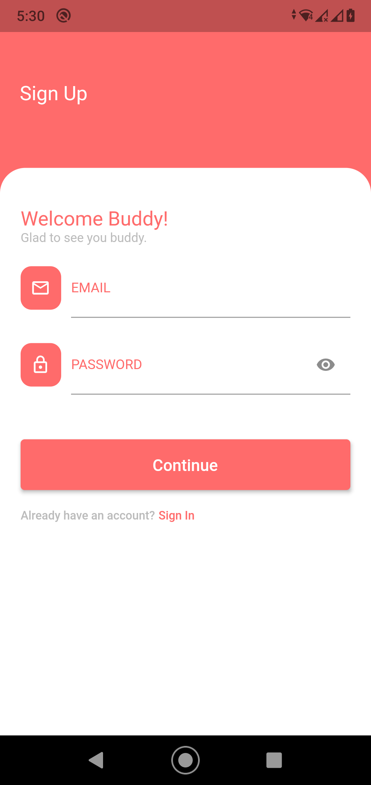
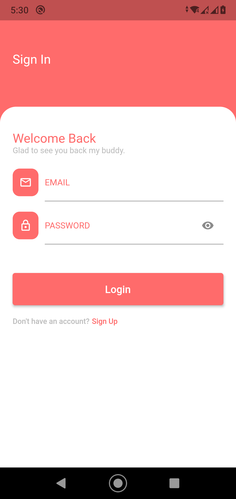
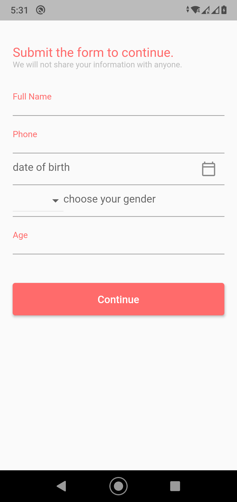
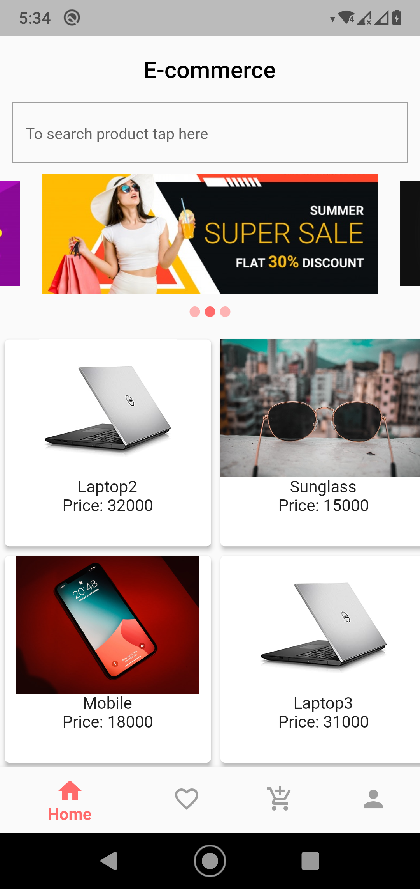
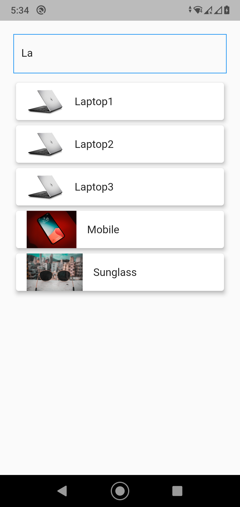
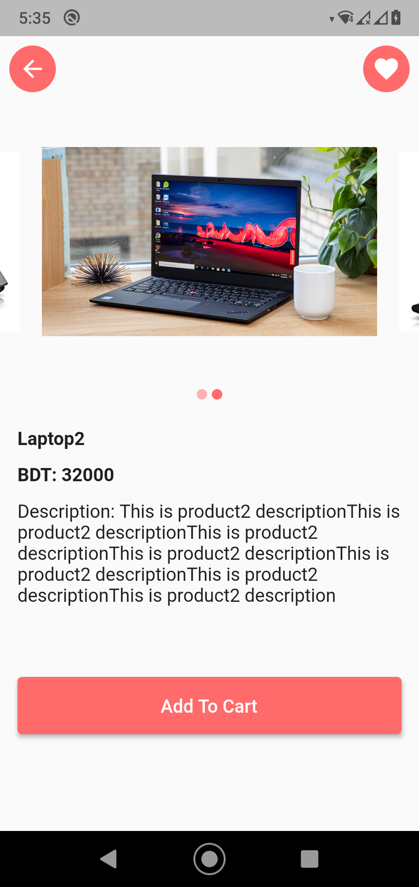
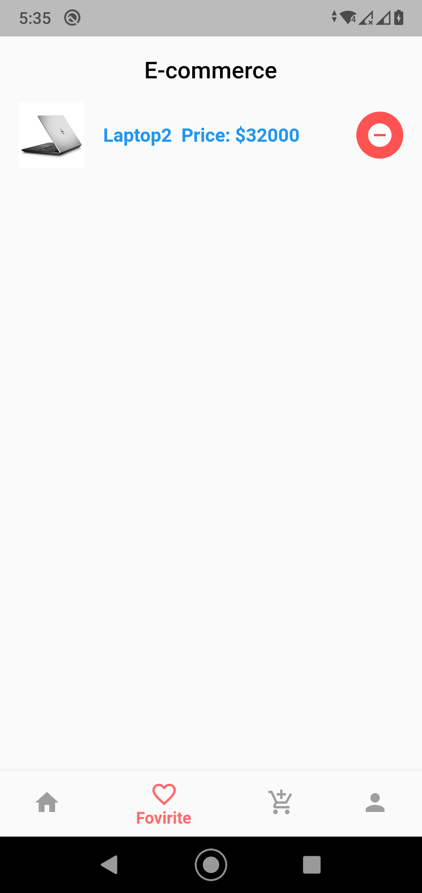
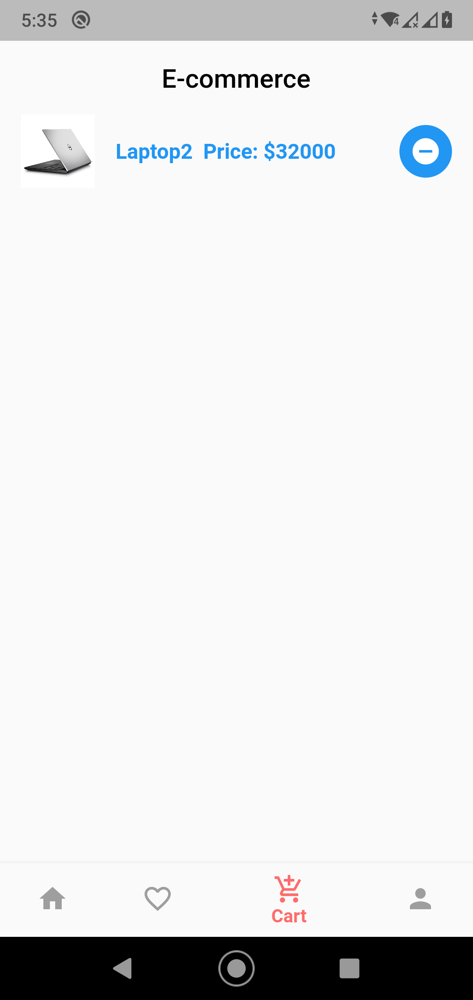
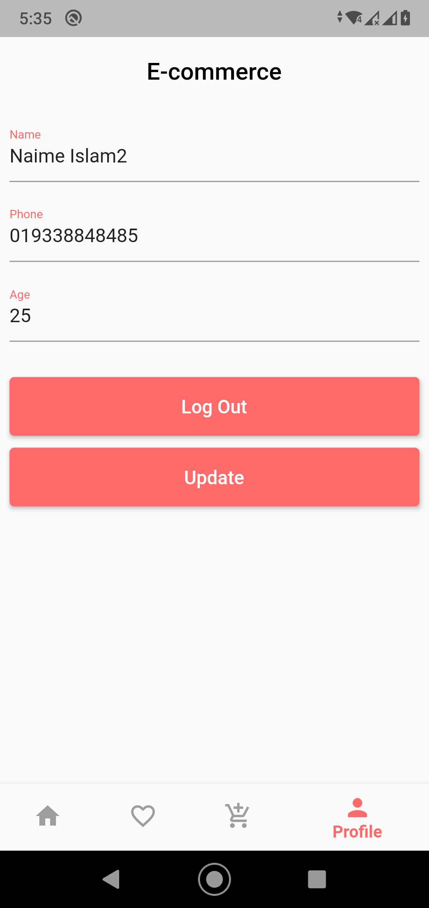

After the splach screen if user not signed in registration screen will appear:

and he can go to sign in page if user have already an account:

After registration user data page will appear to take data about user:

Then Homescreen will appear with carousel slider and products and if user login with login page then homepage will appear too:

If user want to search specific product the he can search for that:

Then if user click any product from homepage then he will get products details page from where he can add product to cart and can add to favourite and by again click on favourite icon he can remove product from favourite list list:

Then User can see favourite product list from favourite section:

User can see carted product list from cart section:

Then user can go profile section and can update data and can logout from his account:

